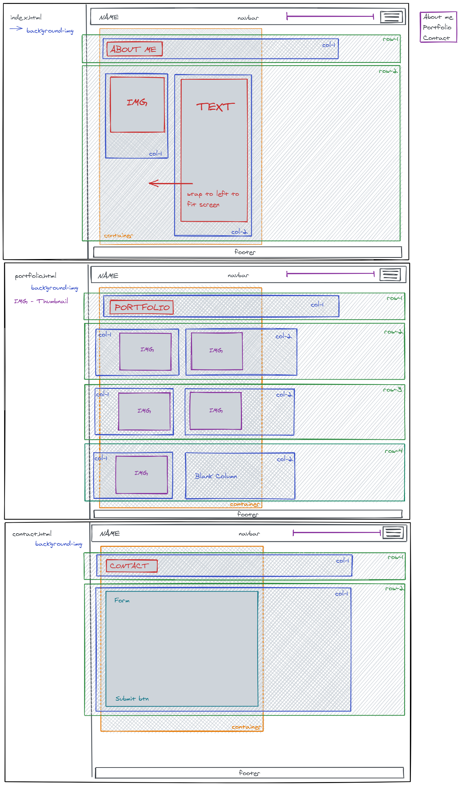

# Portfolio

Building an Online Portfolio using Bootstrap.

Applying CSS elements to make a unique responsive portfolio layout. 

*Practice/Mock-up for future official portfolio. All photos on about/portfolio pages are placeholders*

Page Link
    https://sclitty.github.io/Responsiveness-Portfolio/index.html

Page Layout
    

About Me Page (index)
    

Portfolio Page -
    

Contact Page -
    

Page Demo - 
    

