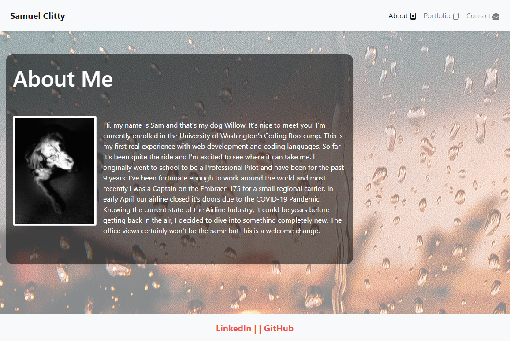
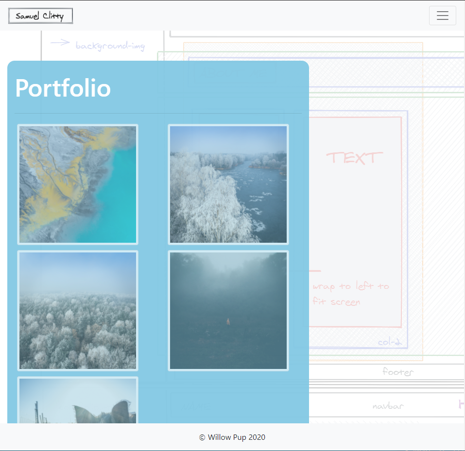
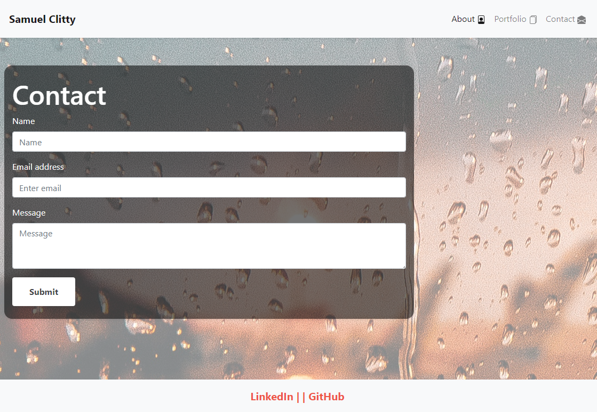

# Samuel Clitty's Portfolio

**Building an Online Portfolio using Bootstrap.**

Applying CSS elements to make a unique responsive portfolio layout. 

Page Link
    https://sclitty.github.io/Responsiveness-Portfolio/index.html

About Me Page (index)
    

Portfolio Page -
    

Contact Page -
    

Page Demo - 
    

