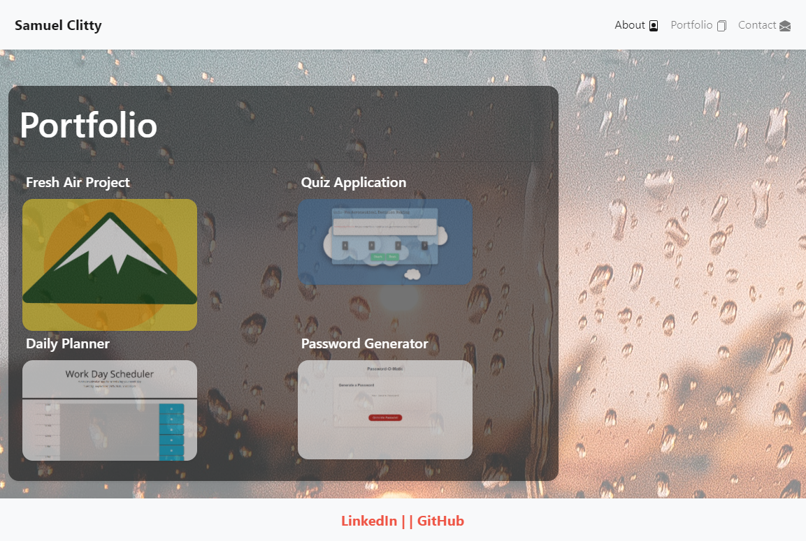

# Responsiveness-Portfolio
Homework Assignment 2

Building an Online Portfolio using Bootstrap 
Applying CSS elements to make a unique responsive portfolio layout. 

Page Layout - 

About Me Page (index) - 

Portfolio Page -

Contact Page -

Notes
    - had issues setting background image 
        -  corrected issues with bg img noted in style.css 
        - used page layout as background-img since it looked cool and fitting as a learning web developer
    - renamed "< container >" div to a standard "< div >" was causing issues with css
        probably a better semantic tag but div works well. 
    - styling elements with css 
   

    Portfolio Page 
        -added media query to prevent img overlap and smaller screens 

